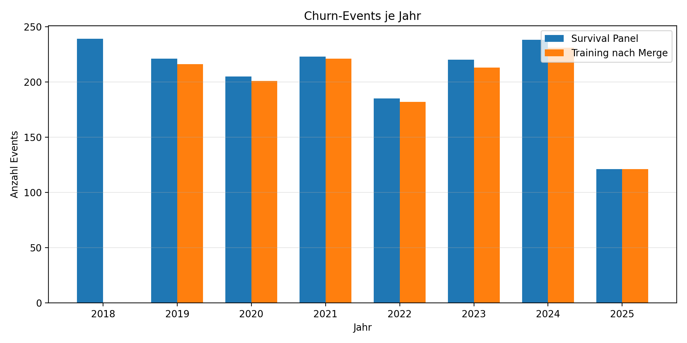
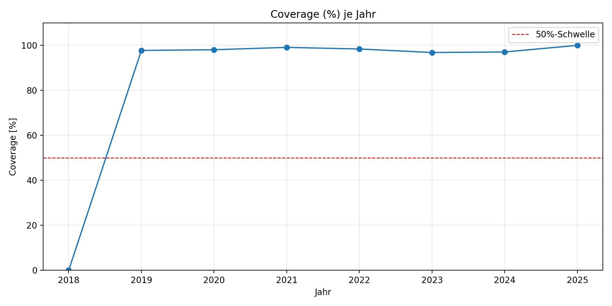

# Cox Coverage & Rolling Report
*Generated: 2025-10-06 16:39*

## Coverage-Übersicht
|   year |   events_panel |   censored_panel |   events_train |   coverage_pct |
|-------:|---------------:|-----------------:|---------------:|---------------:|
|   2018 |            239 |                3 |              0 |           0    |
|   2019 |            221 |               11 |            216 |          97.74 |
|   2020 |            205 |               10 |            201 |          98.05 |
|   2021 |            223 |               15 |            221 |          99.1  |
|   2022 |            185 |                0 |            182 |          98.38 |
|   2023 |            220 |                0 |            213 |          96.82 |
|   2024 |            238 |                0 |            231 |          97.06 |
|   2025 |            121 |             4705 |            121 |         100    |





## Jahre mit Coverage < 50%
- **2018**: 0.0% (0/239 Events im Training)

## History-Verfügbarkeit vor dem Event
Jahr | Median Monate | P25 | P75 | Events
--- | --- | --- | --- | ---
2018 | 7.0 | 4.0 | 9.0 | 239
2019 | 19.0 | 15.0 | 21.0 | 221
2020 | 31.0 | 26.0 | 33.0 | 205
2021 | 41.0 | 37.0 | 45.0 | 223
2022 | 55.0 | 51.0 | 57.0 | 185
2023 | 66.0 | 61.0 | 69.0 | 220
2024 | 76.0 | 51.0 | 81.0 | 238
2025 | 85.0 | 28.0 | 88.0 | 121

## Rolling-Empfehlung (leckagefrei)
```python
customer_data = customer_data.sort_values(['Kunde', 'I_TIMEBASE'])
for feature in ROLLING_COLS:
    customer_data[f'{feature}_roll3'] = (
        customer_data.groupby('Kunde')[feature]
        .shift(1)
        .rolling(window=3, min_periods=1)
        .mean()
    )
```

**Prüfhinweis:** Keine forward-looking Berechnungen (shift(1) vor rolling) – bestätigt.

## Handlungsempfehlungen
- Mindestens 48 Monate Historie bereitstellen, damit >50% der Churn-Fälle abgedeckt werden.
- Jahr 2018: nur Median 7.0 Monate verfügbar – expanding Fenster (mit shift(1)) oder kürzere Rolling-Fenster verwenden.
- Jahr 2019: nur Median 19.0 Monate verfügbar – expanding Fenster (mit shift(1)) oder kürzere Rolling-Fenster verwenden.
- Jahr 2020: nur Median 31.0 Monate verfügbar – expanding Fenster (mit shift(1)) oder kürzere Rolling-Fenster verwenden.
- Coverage 2018: 0.0% – Feature-Merge prüfen (fehlende Kunden in `customer_churn_details`) und History rückwärts erweitern.